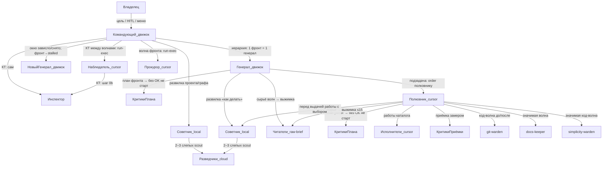
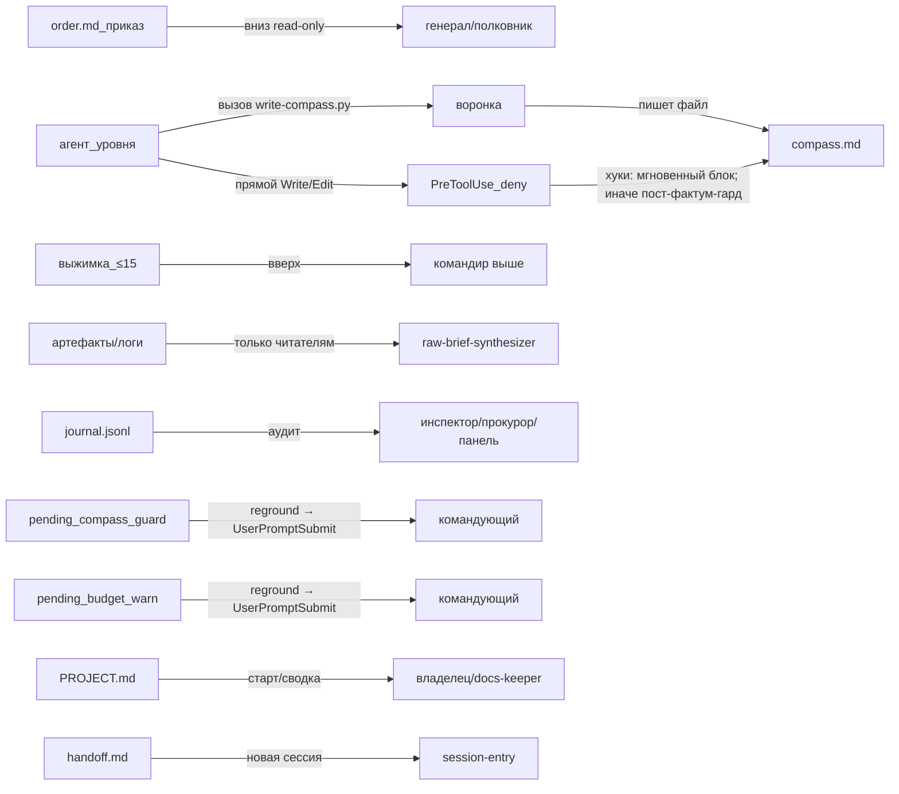

# FLOW — канонический граф потоков оркестрации

Счёт: **§1:** 19 узлов / 22 ребра · **§2:** 20 узлов / 12 рёбер · **гейты §3:** 15.

## 1. Кто кого запускает

Легенда моделей: **умный движок** — командующий (оркестратор сессии), генерал (`SKILL.md` § Иерархия больших проектов; `traps.md:№25`). **cursor local** — наблюдатель, прокурор (запуск командующим через `run-exec`: наблюдатель на КТ между волнами, прокурор на каждую волну фронта); советник; код-исполнители (`front-observer.md`; `front-prosecutor.md`; `opportunity-advisor.md`; `SKILL.md` § Исполнители: режим). **инспектор** — runtime в роли не задан (`invocation-inspector.md`). **cursor cloud** — не-код + web-scout (`SKILL.md` § Исполнители: режим; `web-scout.md`). **полковник dual** — код → local-cursor, прочее → cloud (`SKILL.md` § Иерархия больших проектов; `front-colonel.md`).

Источники рёбер: владелец→командующий (`SKILL.md` § Вход новой сессии); командующий→генерал (`SKILL.md` § Иерархия больших проектов; `planning.md` §3.7); командующий→наблюдатель/прокурор через `run-exec` (`SKILL.md` § Иерархия / Запуск наблюдателя и прокурора; `planning.md` §3.7; `front-observer.md`; `front-prosecutor.md`); командующий→инспектор (`SKILL.md` § Иерархия больших проектов); командующий→новый генерал при зависании окна (`SKILL.md` § ПРОЦЕДУРА «ЗАВИСШЕЕ…»; `planning.md` §3.7 ПРОЦЕДУРА «ЗАВИСШЕЕ…»; `traps.md:№51`); командующий→советник (`SKILL.md` § Иерархия / Развилки командующего; `planning.md` §3.7 Развилки командующего); наблюдатель→инспектор (`front-observer.md`); генерал→советник/критики/полковники/читатели (`front-general.md`; `planning.md` §3.7); советник→разведчики (`opportunity-advisor.md`); полковник→свита (`front-colonel.md`; `planning.md` §3.7).

## 2. Куда идут данные

Лимиты курса: сессия ≤8500; фронт/полковник ≤4000 (`orchlib.py`; `MAP.md` § B. State). Приказы отдельно от курса (`traps.md:№47`; `front-general.md`). Журнал пишут `run-exec`/`run-cloud` (`run-exec.py`; `run-cloud.py`; `MAP.md` § B. State). Компас: агент вызывает воронку `write-compass.py`, воронка пишет файл; прямой Write/Edit в компас: блок PreToolUse (сессии с хуками) + пост-фактум-гард для остальных (`SKILL.md` § Сверка курса; `traps.md:№48`).

## 3. Таблица гейтов

| шаг | гейт | что проверяет | механизм | исход | ист. |
|---|---|---|---|---|---|
| запуск run | FRONT_REQUIRED | hierarchy≠off и нет --front/--no-front | `resolve_front_launch` + `journal_gate_refuse` | `FRONT_REQUIRED`, exit 8 | `orchlib.py`; `run-exec.py`; `run-cloud.py` |
| запуск run | секрет-сканер | паттерны ключей/токенов в промте | `run-exec`/`run-cloud` `scan_secrets` | `SECRETS_IN_PROMPT`, exit 5 | `run-exec.py`; `traps.md:№43` |
| запись курса | лимит compass (воронка) | size ≤ max_session/front | `write-compass.py` | exit 2, файл не пишется, pending | `write-compass.py` |
| прямой Write/Edit в compass | PreToolUse-deny компаса | путь compass + инструмент Write/Edit | PreToolUse (хуки Kimi): мгновенный deny; иначе пост-фактум-гард | deny / громкий блок / флаг | `reground.py` PreToolUse; `SKILL.md` § Хуки Kimi / PreToolUse; `traps.md:№48` |
| Write/Edit order.md | обоснование приказа | строка «подход:» / «без советников» | PreToolUse + `_order_has_basis` | deny exit 2 | `reground.py`; `orchlib.py`; фолбэк: чипы/инспектор |
| обход воронки | лимит compass (пост-фактум) | живое превышение / pending | `reground` prompt-submit; panel guard | громкий блок / флаг | `reground.py`; `SKILL.md` § Сверка курса |
| запуск `--front` | закрытый фронт | status ∈ cancelled\|rejected | `apply_front_gates` / `apply_launch_gates` | `FRONT_CLOSED`, exit 6 | `run-exec.py`; `run-cloud.py` |
| bump прогонов | бюджет warn | used ≥ warn (деф. 60 в params) | `bump_front_runs` + `emit_pending_budget_warn` | `FRONT_BUDGET_WARN`, продолжается | `run-exec.py`; `run-cloud.py`; деф.60: `orchlib.py` |
| bump прогонов | бюджет hard | hard>0 и used>hard | то же | `BUDGET_HARD`, exit 7 | `run-exec.py` |
| end роли волны | автопрокурор | idle фронт + ≥1 wave-end после last prosecutor; lockdir | `maybe_auto_prosecutor_after_end` | detached `prosecutor-auto-<F>-<n>` | `run-exec.py`; контроль-после, раз в волну |
| план любого уровня | критики плана | план+цель; без OK не старт | fact-checker / code-reviewer | PROBLEMS/BLOCKED → ремонт плана | `SKILL.md` § План тоже через критиков; `front-colonel.md` |
| после работы | критики приёмки + замер | дифф/артефакт + критерий | красная волна критиков + замер оркестратора | без OK/замера не принято | `planning.md` §4 Волны; `SKILL.md` § Контроль |
| развилка / приёмка фронта | advisor-обоснование | advisor в journal или «без советников» | роль + чек-лист командующего; чип orders_without_basis | иначе PROBLEMS | `front-general.md`; `traps.md:№49` |
| граф / деструктив / 2 круга | HITL | Approve/Revise/Reject | доктрина (вопрос владельцу) | TTL → лестница авто | `SKILL.md` § HITL-ворота; `planning.md` §3.7 HITL-ворота |
| КТ между волнами | SLA наблюдателя | heartbeat ≤30 мин + OK | `observer-heartbeat.txt` | гейт не зелёный | `front-observer.md`; `SKILL.md` § Запуск наблюдателя и прокурора |
| save/волны графа | порядок фронтов | deps, циклы, топосорт | `validate_fronts` / `front_waves` | ошибка «цикл в deps» | `orchlib.py` |
| значимая код-волна | простота | YAGNI/KISS на диффе | `simplicity-warden` | PROBLEMS → ремонт | `simplicity-warden.md`; `front-colonel.md` |
| закрытие фронта | приёмка (журнал+order) | compass≤4000; order; advisor; швы | генерал + командующий; швы — наблюдатель | PROBLEMS / stalled | `front-general.md`; `front-observer.md` |

## 4. Таблица состояний/файлов

| файл | пишет | читает | когда | ист. |
|---|---|---|---|---|
| `fronts.json` | командующий; panel `/api/fronts` | командующий, session-entry, обёртки (status) | граф; статусы proposed/active/stalled/cancelled/rejected/done | `planning.md` §3.7 Граф фронтов; `orchlib.py`; `panel/server.py` |
| `fronts/<id>/order.md` | командующий | генерал (RO); наблюдатель; прокурор; инспектор | приказ → курс / сверка | ген: `MAP.md` § B; `front-general.md`; набл: `front-observer.md`; прок: `front-prosecutor.md`; инсп: `invocation-inspector.md` |
| `fronts/<id>/compass.md` | генерал через `write-compass.py` | генерал, наблюдатель, командующий | курс фронта ≤4000 | `MAP.md` § B; `front-general.md` |
| `fronts/<id>/colonels/<cid>/order.md` | генерал | полковник (RO) | выдача подзадачи | `MAP.md` § B; `front-colonel.md` |
| `fronts/<id>/colonels/<cid>/compass.md` | полковник через воронку | полковник, генерал (замер) | мини-курс ≤4000 | `MAP.md` § B; `front-colonel.md` |
| `fronts/<fid>/observer-heartbeat.txt` | наблюдатель на КТ | приёмка командующего; панель | свежесть ≤30 мин — гейт волны | `front-observer.md`; `SKILL.md` § Запуск наблюдателя и прокурора; `panel/server.py` |
| `sessions/<sid>/compass.md` | командующий через воронку; владелец — menu/панель | командующий; reground (вклейки) | сеанс командующего; сверка курса | `SKILL.md` § Сверка курса; `MAP.md` § B; `menu.py` |
| `sessions/<sid>/prosecutor/` | прокурор; инспектор (доклад в канал) | только командующий | закрытый канал волны (прокурор запускается командующим на каждую волну фронта) | `SKILL.md` § Запуск наблюдателя и прокурора; `front-prosecutor.md`; `invocation-inspector.md` |
| `journal.jsonl` | `run-exec`/`run-cloud` (`journal_append`) | инспектор, прокурор, панель | start/end каждого прогона | `orchlib.py`; `MAP.md` § B |
| `pending_compass_guard.json` | обёртки/`write-compass`/reground/panel | командующий (доставка reground → UserPromptSubmit) | overflow compass | `MAP.md` § B; `orchlib.py`; `reground.py` |
| `pending_budget_warn.json` | обёртки `emit_pending_budget_warn` | командующий (доставка reground → UserPromptSubmit) | warn-бюджет фронта | `orchlib.py`; `run-exec.py`; `SKILL.md` § Бюджеты и статусы фронтов |
| `.orchestration/handoff.md` | командующий | session-entry / новая сессия | границы волн / пауза ≤2000 | `SKILL.md` § Вход новой сессии / HANDOFF; `session-entry.py` |
| `PROJECT.md` | командующий (старт); docs-keeper | все уровни / владельцу | иерархия; после значимых волн | `SKILL.md` § Документация после волны / PROJECT.md; `docs-keeper.md` |
| `.orchestration/cursor.key` | владелец / panel | `run-cloud` / discover | ключ cloud | `MAP.md` § B; `panel/server.py` |
| `params.json` | menu/panel/владелец | все обёртки, reground | дефолты пачки | `orchlib.py`; `MAP.md` § B |

## 5. Жизненный цикл задачи

1. **Цель владельца** → командующий: `session-entry` (PROJECT/handoff/fronts/compass) (`session-entry.py`).
2. **Критерий + compass сессии**; gate неоднозначности / Assumptions (`planning.md` §0–§1).
3. **Иерархия?** auto/on → граф `fronts.json` + критики плана графа + **HITL** утверждения (`SKILL.md` § Иерархия больших проектов; `planning.md` §3.7 HITL-ворота).
4. **Развилка проекта** → советник (local) → web-scout (cloud); решение командующего (`planning.md` §3.7 Развилки командующего).
5. Командующий пишет `fronts/<id>/order.md` (обязательна строка `подход: … (по N вариантам советника)` ИЛИ `без советников: выбора нет`), стартует **генерала** (движок, умная модель) + **прокурора** (cursor local через `run-exec`, запускается командующим на каждую волну фронта) (`SKILL.md` § Запуск наблюдателя и прокурора; `planning.md` §3.7).
6. Генерал: compass через воронку → декомпозиция → **критики плана** → OK (`front-general.md`).
7. Генерал пишет `fronts/<id>/colonels/<cid>/order.md` (обязательна строка `подход: … (по N вариантам советника)` ИЛИ `без советников: выбора нет, механическая`), запускает **полковника** (cursor) (`front-general.md`).
8. Полковник: перед выдачей работы с выбором → советник→scout; в задании обязательна строка `подход: … (по N вариантам советника)` ИЛИ `без советников: выбора нет`; план → критики OK (`front-colonel.md`).
9. **Развилка исполнения:** роль `code/*` → **local-cursor** (`run-exec --front <fid>` или `--no-front`); иначе → **cloud** (`run-cloud --front/--no-front`) (`SKILL.md` § Исполнители: режим; `MAP.md` § A). Без `--front`/`--no-front` при hierarchy≠off — `FRONT_REQUIRED` exit 8.
10. Код-волна: **git-warden** checkpoint → исполнители → критики приёмки+замер → git revise; значимая → **docs-keeper**; значимая код → **simplicity-warden** (git/docs: `front-colonel.md`; `planning.md` §4 Волны; simplicity: `planning.md` §3.7 таблица этапов; `front-colonel.md`).
10a. **Автопрокурор (S2):** после end роли волны, когда фронт idle — `run-exec` поднимает detached `prosecutor-auto-<F>-<n>` (lockdir, один на волну); ручной прокурор командующего тоже допустим.
11. Сырьё → **raw-brief-synthesizer** (≤15 строк) вверх; генерал/полковник сырьё не читают (`raw-brief-synthesizer.md`).
12. **КТ:** наблюдатель (cursor local через `run-exec`; 4 прицела + heartbeat≤30м) → инспектор по `journal.jsonl` → прокурору/владельцу; без OK наблюдателя следующая волна графа не стартует (`front-observer.md`; `SKILL.md` § Запуск наблюдателя и прокурора).
13. **Сбой окна генерала** → снять окно; фронт → `stalled` (не `cancelled`); новый генерал входит через `order.md` + компас (курс) + журнал фронта; бегущие волны НЕ перезапускать — окно приёмки (`start` без `end` = бежит); новые волны — только для незакрытых работ (`SKILL.md` § ПРОЦЕДУРА «ЗАВИСШЕЕ…»; `planning.md` §3.7 ПРОЦЕДУРА «ЗАВИСШЕЕ…»; `front-general.md`; `traps.md:№51`).
14. Приёмка фронта: compass≤4000, order, advisor/journal, швы; статус `done` / иначе PROBLEMS/stalled (`front-general.md`; `SKILL.md` § Иерархия больших проектов).
15. Итоговая сшивка `report-synthesizer` + критики → доклад владельцу; handoff на паузе (`planning.md` §4 Волны / §5; `SKILL.md` § Вход новой сессии / HANDOFF).

## 6. Источники

- `skills/orchestration/SKILL.md`
- `skills/orchestration/references/MAP.md`
- `skills/orchestration/references/planning.md`
- `skills/orchestration/references/traps.md`
- `skills/orchestration/references/roles/meta/front-general.md`
- `skills/orchestration/references/roles/meta/front-colonel.md`
- `skills/orchestration/references/roles/meta/front-observer.md`
- `skills/orchestration/references/roles/meta/front-prosecutor.md`
- `skills/orchestration/references/roles/meta/invocation-inspector.md`
- `skills/orchestration/references/roles/meta/opportunity-advisor.md`
- `skills/orchestration/references/roles/meta/web-scout.md`
- `skills/orchestration/references/roles/meta/raw-brief-synthesizer.md`
- `skills/orchestration/references/roles/code/git-warden.md`
- `skills/orchestration/references/roles/code/docs-keeper.md`
- `skills/orchestration/references/roles/code/simplicity-warden.md`
- `skills/orchestration/references/roles/code/coder.md`
- `skills/orchestration/references/roles/code/code-reviewer.md`
- `skills/orchestration/references/roles/research/fact-checker.md`
- `bin/run-exec.py`, `bin/run-cloud.py`, `bin/orchlib.py`, `bin/write-compass.py`, `bin/reground.py`, `bin/session-entry.py`, `bin/verdict.py`
- `panel/server.py`
